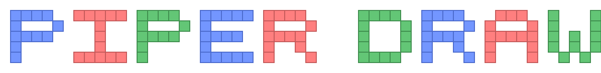

<p align="center">
  
</p>

An open source web application for building pipe diagrams for topological quantum error correction.

## About
Piper-draw is a visual editor for [TQEC](https://github.com/tqec/tqec) block graphs. You assemble cubes and pipes on a 3D grid, then export to Collada (`.dae`) or hand the diagram to a FastAPI backend that runs [`tqec`](https://github.com/tqec/tqec) for validation, stabilizer-flow (correlation-surface) analysis, and ZX-calculus conversion.

Cube and pipe naming follows the TQEC convention — see [the terminology guide](https://tqec.github.io/tqec/user_guide/terminology.html).

## Getting started

### Prerequisites
- Python 3.14+
- [uv](https://docs.astral.sh/uv/) (or any other Python package manager)
- Node.js and npm

### Install
```sh
make install
```
Installs Python dependencies via `uv` and frontend dependencies via `npm`.

### Run the dev servers
```sh
make dev
```
Starts the Vite frontend and the FastAPI backend (`uvicorn`). Open the URL shown in the terminal (typically http://localhost:5173).

### Other commands
- `make test` — run Python and GUI tests
- `make test-python` / `make test-gui` — run them individually
- `make build` — build the GUI for production
- `make lint` — lint the GUI

## Usage

Click the **?** button in the app for an in-context summary of modes, tools, and shortcuts.

### Building a diagram
Piper-draw has two interaction modes for placing blocks:

- **Drag / Drop** — arm a placement tool in the toolbar (cube, pipe, or port) to click-place blocks, or switch to **Select** to pick existing blocks. Shift-click adds/removes from the selection, Ctrl+Shift-drag marquee-selects cubes, pipes, and ports. Hold the delete modifier to click-to-delete.
- **Keyboard Build** — move a cursor with the arrow keys / WASD to extend from the last block. Cycle cube and pipe variants with `C` and `R`, undo a step with `Q`, exit with `Esc`.

Use the **Iso ▾** menu in the toolbar to snap to an axis-locked orthographic view; slice stepping auto-advances through depth as you build.

### Analysis
- **Verify (tqec)** — check that the diagram is a valid TQEC block graph. Errors are highlighted inline on the offending cubes.
- **Flows (tqec)** — compute stabilizer flows (correlation surfaces) and visualize each surface directly in 3D. Edit the Pauli basis on ports to query custom flows.
- **ZX diagrams (tqec, pyzx)** — convert the diagram to a ZX-calculus graph, optionally simplify it, and extract the corresponding quantum circuit using [PyZX](https://github.com/zxcalc/pyzx). Export to `.qgraph`, `.qasm`, `.qc`, or `.qsim`.

### Files
- **Import** / **Export** round-trip through Collada (`.dae`) files.
- **Templates** — load a bundled example diagram (CNOT, CZ, move + rotation, three CNOTs, Steane encoding) as a starting point, or insert one into the current scene.

### Bundled templates
The `.dae` files served from `gui/public/templates/` are generated from [`tqec.gallery`](https://github.com/tqec/tqec/tree/main/src/tqec/gallery) — they originate from the TQEC project and are bundled here for convenience. Re-run the generator if TQEC is updated:
```sh
uv run python scripts/generate_templates.py
```
